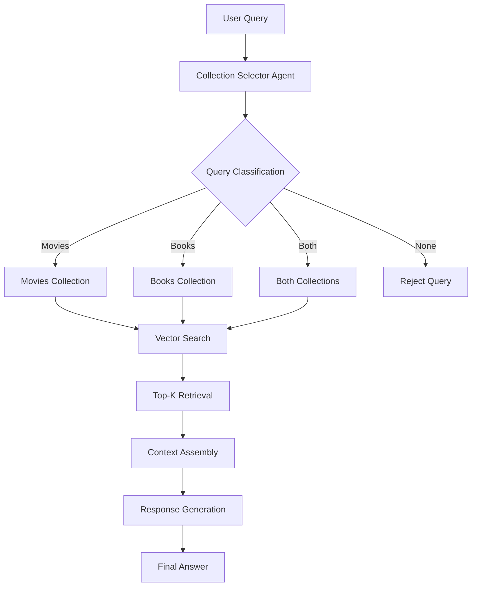

# CineBot - Movie & Book RAG Chatbot

A sophisticated AI-powered entertainment curator that uses **Retrieval-Augmented Generation (RAG)** to provide personalized movie and book recommendations. Built with Next.js, ChromaDB, and powered by Google's Gemini AI.

## 🎯 Project Overview

CineBot is an intelligent chatbot that combines semantic search with large language models to deliver contextually relevant recommendations for movies and books. The system leverages RAG architecture to ground AI responses in a curated knowledge base, ensuring accurate and helpful suggestions.

## 🏗️ RAG System Architecture

### Core RAG Components

```
User Query → Collection Selector → Vector Search → Context Retrieval → Response Generation
```

#### 1. **Document Ingestion Pipeline**

- **Data Sources**: JSON files containing movie and book metadata
- **Embedding Model**: OpenAI's `text-embedding-3-small` for production queries
- **Fallback Embedder**: `Xenova/all-MiniLM-L6-v2` (Transformers.js) for local processing
- **Vector Database**: ChromaDB for efficient similarity search
- **Document Processing**: Combines title, description, genres, and metadata into searchable text chunks

#### 2. **Intelligent Collection Selection**

- **Agent**: `collection-selector-agent.ts` determines which collections to query
- **Classification**: Uses Gemini 2.0 Flash to classify queries as movies, books, both, or neither
- **Dynamic Routing**: Automatically routes queries to appropriate knowledge bases

#### 3. **Semantic Retrieval**

- **Vector Search**: Embeds user query and finds top 5 most similar documents
- **Distance-Based Filtering**: Filters results by semantic similarity scores
- **Multi-Collection Support**: Can search across movie and book collections simultaneously
- **Metadata Preservation**: Maintains rich metadata (year, author, genres, cast) for context

#### 4. **Response Generation**

- **Context Assembly**: Combines retrieved documents with user query
- **Prompt Engineering**: Structured prompts ensure focused, relevant responses
- **LLM Integration**: Google Gemini 2.0 Flash generates natural language responses
- **Response Grounding**: Answers strictly based on retrieved knowledge base content

### RAG Data Flow



## 🛠️ Technical Stack

- **Frontend**: Next.js 14, React, TypeScript, TailwindCSS, Radix UI
- **Backend**: Next.js API Routes, Node.js
- **Vector Database**: ChromaDB (HTTP server)
- **AI Models**:
  - Google Gemini 2.0 Flash (text generation)
  - OpenAI text-embedding-3-small (embeddings)
  - Xenova/all-MiniLM-L6-v2 (local embeddings)
- **Libraries**: AI SDK, Transformers.js, Zod for validation

## 📁 Project Structure

```
movie-book-chatbot/
├── app/
│   ├── api/(chat)/
│   │   ├── route.ts                 # Main chat API endpoint
│   │   └── collection-selector-agent.ts # Collection routing logic
│   ├── page.tsx                     # Chat interface
│   └── layout.tsx
├── lib/
│   ├── database/
│   │   └── chroma.js               # ChromaDB client configuration
│   ├── prompts/
│   │   ├── collection-selector-prompt.ts # Classification prompts
│   │   └── generate-response-prompt.ts   # Response generation prompts
│   ├── types/
│   │   └── chat-api.ts             # TypeScript interfaces
│   └── embedder.js                 # Local embedding functions
├── data/
│   ├── movies.json                 # Movie knowledge base
│   └── books.json                  # Book knowledge base
├── scripts/
│   └── ingest.js                   # Data ingestion script
└── chroma/                         # ChromaDB storage
```

## 🚀 Setup & Installation

### Prerequisites

- Node.js 18+
- pnpm (recommended) or npm
- ChromaDB server
- OpenAI API key
- Google AI API key

### 1. Clone & Install

```bash
git clone <repository-url>
cd movie-book-chatbot
pnpm install
```

### 2. Environment Setup

Create `.env.local`:

```env
NEXT_PUBLIC_OPENAI_API_KEY=your_openai_api_key
GOOGLE_GENERATIVE_AI_API_KEY=your_google_ai_api_key
```

### 3. Start ChromaDB Server

```bash
# Using Docker
docker pull chromadb/chroma
docker run -p 8000:8000 chromadb/chroma

# Or install locally
pip install chromadb
chroma run --host localhost --port 8000
```

### 4. Ingest Data

```bash
node scripts/ingest.js
```

### 5. Run Application

```bash
pnpm dev
```

## 💾 Data Sources

### Movies Dataset

- **Structure**: Title, year, cast, genres, description, thumbnail
- **Examples**: The Grudge (2020), sci-fi blockbusters, indie films
- **Metadata**: Rich cast information, release years, genre classifications

### Books Dataset

- **Structure**: Title, author, ISBN, description, publisher, publication date
- **Examples**: Programming books, literature, technical guides
- **Metadata**: Publisher info, page counts, publication dates

## 🔧 RAG System Configuration

### Embedding Configuration

```javascript
// OpenAI Embeddings (Production)
const embeddingFunction = new OpenAIEmbeddingFunction({
  apiKey: process.env.NEXT_PUBLIC_OPENAI_API_KEY,
  modelName: "text-embedding-3-small",
});

// Local Embeddings (Fallback)
const embedder = await pipeline(
  "feature-extraction",
  "Xenova/all-MiniLM-L6-v2"
);
```

### Search Parameters

- **Top-K Results**: 5 documents per collection
- **Similarity Threshold**: Configurable via distance scores
- **Multi-Collection**: Parallel search across relevant databases

### Response Generation

- **Model**: Google Gemini 2.0 Flash
- **Context Window**: Optimized for retrieved document context
- **Response Limits**: Up to 3 recommendations per category

## 🎨 Features

### Chat Interface

- **Modern UI**: Clean, responsive design with TailwindCSS
- **Real-time Chat**: WebSocket-style message flow
- **Loading States**: Typing indicators and error handling
- **Quick Actions**: Pre-defined query buttons for common requests

### RAG Capabilities

- **Semantic Search**: Understanding query intent, not just keywords
- **Multi-Modal**: Handles both movie and book queries intelligently
- **Context-Aware**: Maintains conversation context for follow-ups
- **Fallback Handling**: Graceful degradation when no relevant content found

## 🚦 API Endpoints

### `POST /api/(chat)`

Main chat endpoint handling the full RAG pipeline:

**Request:**

```json
{
  "messages": [
    {
      "id": "1",
      "content": "Recommend sci-fi movies like Blade Runner",
      "role": "user"
    }
  ]
}
```

**Response:**

```json
{
  "text": "Based on your interest in Blade Runner, I recommend these sci-fi films: ..."
}
```

## 🔍 RAG System Deep Dive

### Document Processing

1. **Text Extraction**: Combines title, description, genres into searchable text
2. **Metadata Flattening**: Converts arrays/objects to string format for ChromaDB
3. **Chunking Strategy**: Each movie/book becomes one document chunk
4. **ID Generation**: Unique identifiers with timestamps for versioning

### Query Processing

1. **Intent Classification**: Determines if query relates to movies, books, or both
2. **Embedding Generation**: Converts query to vector representation
3. **Similarity Search**: Finds semantically similar documents
4. **Context Assembly**: Formats retrieved docs for LLM consumption

### Response Generation

1. **Prompt Engineering**: Structured prompts with clear instructions
2. **Context Injection**: Relevant documents provided as grounded knowledge
3. **Response Synthesis**: LLM generates natural language recommendations
4. **Quality Control**: Responses limited to available knowledge base content

## 📊 Performance Considerations

- **Embedding Caching**: Consider implementing embedding cache for common queries
- **Batch Processing**: Ingest script processes documents in batches
- **Error Recovery**: Graceful handling of API failures and timeouts
- **Scalability**: ChromaDB can handle growing document collections

## 🔮 Future Enhancements

- **User Preferences**: Persistent user profile and recommendation history
- **Advanced Filtering**: Genre, year, rating-based filtering
- **Multimedia Support**: Image-based search and recommendations
- **Real-time Updates**: Dynamic ingestion of new movies/books
- **Conversation Memory**: Multi-turn conversation context preservation

## 📄 License

This project is open source and available under the MIT License.

---

**CineBot** - Where AI meets entertainment discovery through intelligent RAG-powered recommendations.
